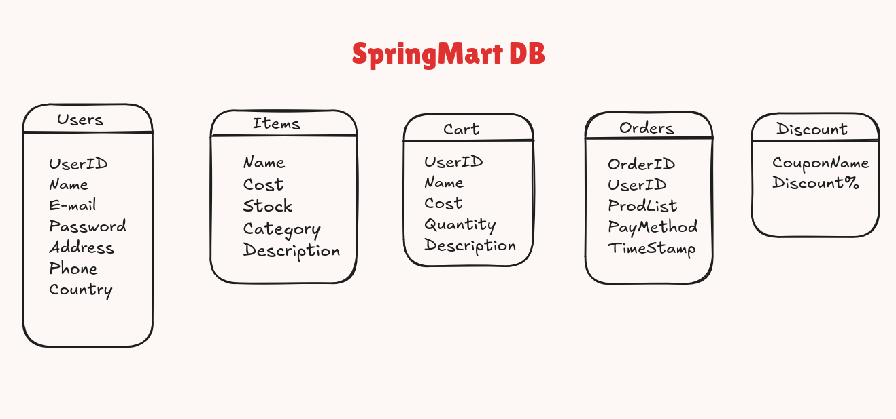
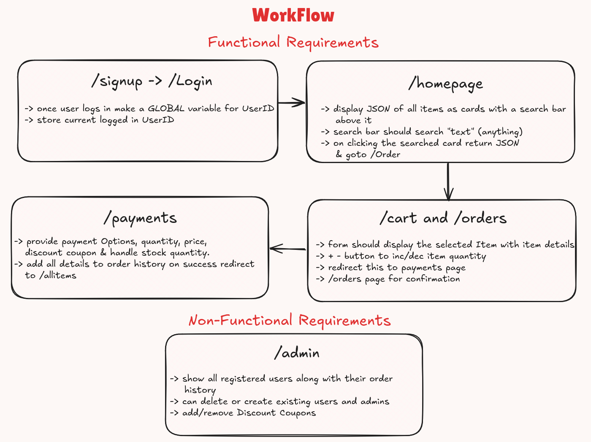

# Spring Mart

A simple E-Commerce Website built using SpringBoot, MVC architecture and jsps :D

### How To Run

```bash
mvn install
mvn spring-boot:run
```
### using Docker
```bash
docker build -t springmart .
docker run -it --rm -p 8686:8686 springmart:latest
```

### DataBase Schema


### WorkFlow
